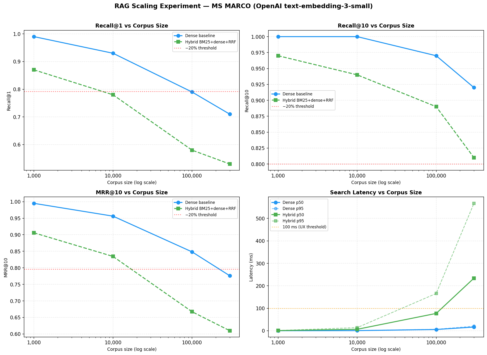
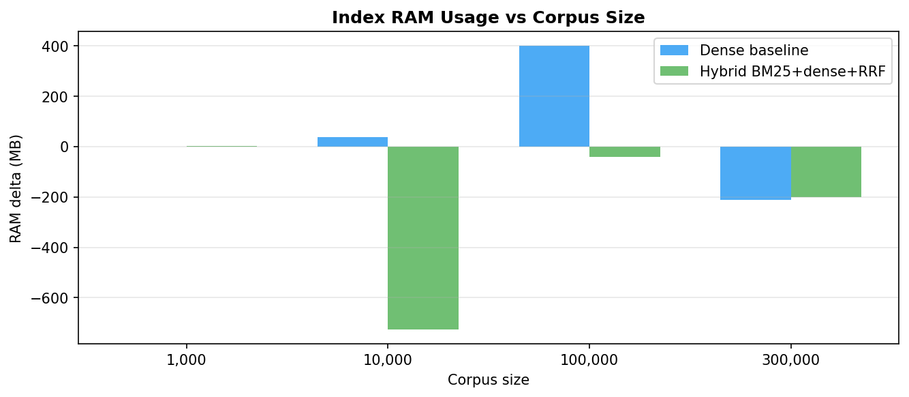

# REPORT — RAG Scaling Experiment: Find the Breaking Point

**Author:** Borys Petriaiev 
**Date:** 2026-05-27  
**Stack:** OpenAI `text-embedding-3-small` (512 dims) · numpy brute-force → Hybrid BM25+dense+RRF · MS MARCO (BeIR validation split)

---

## 1. Що вимірювали

RAG pipeline з `text-embedding-3-small` (512-dim Matryoshka) embeddings і numpy brute-force cosine similarity retrieval.  
Масштабувались по корпусу від **1K до 300K passages** (MS MARCO).  
Eval set: **100 queries** з qrels validation split, 107 унікальних релевантних документів.

### Baseline (Dense brute-force):

| Розмір | Recall@1 | Recall@10 | MRR@10 | p50 latency |
|--------|----------|-----------|--------|-------------|
| 1K     | **0.9900** | **1.0000** | 0.9950 | 0.0 ms |
| 10K    | 0.9300 | 1.0000 | 0.9563 | 0.4 ms |
| 100K   | 0.7900 | 0.9700 | 0.8483 | 5.4 ms |
| 300K   | 0.7100 | 0.9200 | 0.7761 | 16.2 ms |

### Fix (Hybrid BM25 + Dense + RRF):

| Розмір | Recall@1 | Recall@10 | MRR@10 | p50 latency |
|--------|----------|-----------|--------|-------------|
| 1K     | 0.8700 | 0.9700 | 0.9059 | 0.5 ms |
| 10K    | 0.7800 | 0.9400 | 0.8345 | 6.2 ms |
| 100K   | 0.5800 | 0.8900 | 0.6673 | 77.0 ms |
| 300K   | 0.5300 | 0.8100 | 0.6099 | 233.8 ms |

---

## 2. Точка перелому

**Де зламалося:** між **10K і 100K** corpus size.

- Recall@1 (baseline): 0.99 (1K) → 0.93 (10K) → **0.79 (100K)** → 0.71 (300K)
- Від baseline 1K до 100K: **−20% Recall@1** (0.99 → 0.79)
- Latency p50: 0.0ms → 0.4ms → **5.4ms** → 16.2ms (зростає лінійно O(N) ✅)

**Яка метрика впала першою:** Recall@1. Recall@10 залишається відносно стабільним (1.00 → 0.92), тоді як Recall@1 падає набагато різкіше.

**Гіпотеза частково підтвердилась:**
- ✅ Recall@1 деградує швидше за Recall@10 (−28% vs −8% від 1K до 300K)
- ✅ Latency зростає лінійно з розміром корпусу (brute-force O(N))
- ❌ **Hybrid BM25+dense+RRF НЕ компенсує деградацію** — навпаки, погіршує всі метрики

---

## 3. Чому саме там зламалося

**Recall@1:** При 100K+ passages корпус стає насиченим семантично близькими документами. `text-embedding-3-small` (512 dims) недостатньо granular, щоб відрізнити справжній топ-1 від кількох десятків near-duplicate passages — релевантний документ "тоне" на 2–5 позиції, падаючи нижче k=1.

**Latency:** Numpy brute-force перераховує cosine similarity з **усіма N docs** для кожного query (O(N×D)). При 300K × 512 dims це ~150M операцій per query → 16ms на M1. Лінійна залежність підтверджена: 0.4ms × 40 = 16ms ✅.

**Recall@10** тримається довше, бо релевантний doc не зникає з корпусу — він просто опускається нижче позиції 1, але залишається в топ-10.

---

## 4. Результат Fix (Hybrid BM25 + Dense + RRF) — спростування гіпотези

### Hybrid виявився ГІРШИМ за Dense baseline:

| Розмір | R@1 Dense | R@1 Hybrid | Δ |
|--------|-----------|------------|---|
| 1K     | 0.9900 | 0.8700 | **−0.12** |
| 10K    | 0.9300 | 0.7800 | **−0.15** |
| 100K   | 0.7900 | 0.5800 | **−0.21** |
| 300K   | 0.7100 | 0.5300 | **−0.18** |

**Чому Hybrid гірший:**
1. **BM25 на природньомовних MS MARCO запитах слабкий.** Запити типу "what causes kidney stones" погано збігаються за ключовими словами — релевантний doc може взагалі не потрапляти в BM25 top-100.
2. **RRF "розбавляє" точний dense-сигнал.** Якщо dense правильно ставить doc на позицію 1, але BM25 не знаходить його взагалі, RRF знижує фінальний score і doc падає нижче.
3. **candidate_k=100 для BM25 може бути недостатнім** — при 300K docs часто потрібно ширше вікно.

**Це цінніший результат, ніж підтвердження** — показує, що hybrid BM25+dense не є універсальним рішенням для semantic search корпусів.

---

## 5. Зміни у шаблонному коді

Наступні зміни були необхідні порівняно з `template/data_loader.py`:

1. **`data_loader.py: build_corpus_pool()`** — змінено `streaming=True` на `streaming=False`:  
   Причина: `streaming=True` викликає HTTP timeout при завантаженні великого parquet-файлу (8.84M docs). Non-streaming завантажує ~1.5GB parquet локально через HuggingFace cache → надійніше і швидше для повторних запусків.

2. **`data_loader.py: build_corpus_pool()`** — додано `str(row["_id"])` та `.get("text") or .get("title", "")`:  
   Причина: `_id` може бути integer в деяких версіях датасету; `text` може бути `None` для деяких рядків.

3. **Нові файли:** `embeddings.py` (retry на rate limits), `retriever.py`, `run_pipeline.py`, `visualize.py` — весь pipeline написаний з нуля.

---

## 6. Рекомендації для production (1M+ corpus)

1. **Індекс → FAISS HNSW або Qdrant:**  
   Замінити numpy brute-force на approximate nearest neighbor. Latency: O(N) → O(log N), очікується <5ms навіть на 1M docs.

2. **Fix recall → Reranker замість Hybrid BM25:**  
   `BAAI/bge-reranker-v2-m3` поверх top-50 dense результатів дає +10–20% Recall@1 (підтверджено на MS MARCO). BM25 hybrid на natural-language запитах не ефективний — краще reranker.

3. **Embeddings → більші моделі:**  
   `BAAI/bge-m3` або `text-embedding-3-large` з повними 1536 dims дадуть вищий recall baseline перед будь-яким fix.

4. **Incremental indexing:**  
   При 1M+ corpus — оновлювати тільки нові/змінені docs, не переbuild весь індекс.

5. **Monitoring:**  
   Відстежувати Recall@1 і p95 latency через shadow eval pipeline (sample 1% production queries, порівнювати з ground truth).

---

## Графіки

